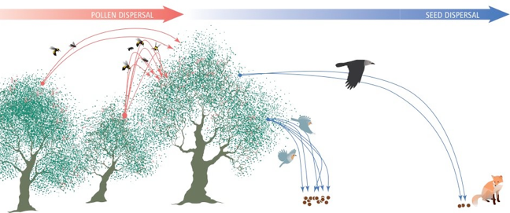

## Assets: what is local, what is still remote

Final state after mirroring (verified against the rendered `public/` on every build):

| | count |
|---|---|
| PDF/supplement files in `static/pdfs/` | 189 |
| Image files in `static/images/` | 697 |
| PDF links in rendered HTML | 187 — all resolve to a local file |
| Image references in rendered HTML | 469 — all resolve to a local file |

### How the PDFs were obtained

1. **48** downloaded from `pjordanolab.ebd.csic.es` (live).
2. **~140** could **not** be downloaded: `ebd10.ebd.csic.es` returns `502 Bad Gateway`
   for every request, including its own root, over both http and https — the legacy host
   is unreachable, it is not rejecting the crawler.
3. Those were recovered from the local archive `/Users/pedro/Documents/Sites/ebd10_new/pdfs`
   (275 PDFs, read-only grant): matched by exact filename, then by a normalisation that folds
   case, unicode hyphen variants and punctuation, then by conservative close-match.
4. The old server's abbreviated names (`HJGT98_AmNat.pdf`, `JordSchu_2000EcolMonogr.pdf`,
   `Conservacao_06.pdf`, …) were resolved by token search on surname + year and **each candidate
   was checked against that entry's own verbatim citation before acceptance** — resemblance of
   filename alone was not accepted. Candidates sharing a surname and year but belonging to a
   different paper or journal were rejected.
5. Filenames are whitespace-normalised (`_` for spaces) on copy. One link was case-corrected
   (`Prunus_Lab_Protocols` → `Prunus_Lab_protocols`) so it survives a case-sensitive web server.

### Links deliberately left pointing at the old host (21)

All on `ebd10.ebd.csic.es`, which is down, and **none of these files are in the local archive** —
press cuttings, two radio recordings, and old HTML abstract/course pages. They were not rewritten,
because pointing them at local files that do not exist would be worse than an honest external link.
If you find these files, drop them in `static/pdfs/` and rewrite the links.

- `http://ebd10.ebd.csic.es/ebd10/Media_files/RNM.pdf`
- `http://ebd10.ebd.csic.es/ebd10/Media_files/http-%3A%3Awww.andaluciainvestiga.com%3Aespanol%3Anoticias%3A2%3A8890.asp.pdf`
- `http://ebd10.ebd.csic.es/evol/cursobioevo.html`
- `http://ebd10.ebd.csic.es/evol/tecmol.html`
- `http://ebd10.ebd.csic.es/media_press/20abril06arquitectura_biodiversidad.pdf`
- `http://ebd10.ebd.csic.es/media_press/CSIC_PNAS_Modul.pdf`
- `http://ebd10.ebd.csic.es/media_press/EBD_Expo_IEG_Poster_screen.pdf`
- `http://ebd10.ebd.csic.es/media_press/EBD_Expo_Semillas_screen.pdf`
- `http://ebd10.ebd.csic.es/media_press/Eds_Choice_Science_2011_1201.pdf`
- `http://ebd10.ebd.csic.es/media_press/Frugivoros_y_semillas_Imagenes_FECYT2004.pdf`
- `http://ebd10.ebd.csic.es/media_press/PUBLICO-07.pdf`
- `http://ebd10.ebd.csic.es/media_press/Pannell_2007_CurrBiol.pdf`
- `http://ebd10.ebd.csic.es/media_press/Pedro@Fund_juan_March_04May2006.mp3`
- `http://ebd10.ebd.csic.es/media_press/REE_Pedro%20Jordano_Dispersion%20de%20semillas.mp3`
- `http://ebd10.ebd.csic.es/media_press/RedLife132.pdf`
- `http://ebd10.ebd.csic.es/media_press/S1a_PT.jpg`
- `http://ebd10.ebd.csic.es/media_press/Science-Magazine.pdf`
- `http://ebd10.ebd.csic.es/mywork/abstr/bascompte_etal_2006_Science.html`
- `http://ebd10.ebd.csic.es/mywork/abstr/diff_contrib_abs.html`
- `http://ebd10.ebd.csic.es/sci/seminarios.html`
- `http://ieg.ebd.csic.es/KimberlyHolbrook/Holbrook.htm`

### Not imported from the old site

`/markdown/` (CV) and `/outreach/` exist in the local archive but were never part of the
imported page set. `ieg.ebd.csic.es/KimberlyHolbrook/Holbrook.htm` is a third-party page and
is correctly left external.

### Three PDF links removed

`Garcia_etal_2009_MolEcol_Reply_Prunus`, `JEcolGeogr2000` and
`Mello_etal_2011_Oecologia_BatBird_networks_modularity` are absent from both the live host and
the archive. Their dead PDF icons were removed; the citations themselves are untouched.

### Other fixes in this pass

- Old-site typo `https://http://…` normalised.
- Gallery lightbox anchors (`…/pageN-…-full.html`) unwrapped: images keep their picture but no
  longer link to the dead server. Gallery pagination paths collapse onto `/gallery/`.
- Absolute links to the old domain converted to site-relative paths.
- Favicon taken from the old site archive; all five PaperMod icon params point at it.
- `.Language.LanguageCode` / `.Language.LanguageDirection` replaced with `.Locale` / `.Direction`
  in the vendored theme templates — the build is now warning-free on Hugo 0.166.0.

## Image paths: editor preview vs. built site

**Symptom.** In VSCode's markdown preview, `` showed a broken-image icon.

**Cause, not a site bug.** Hugo serves `static/` at the site root, so `/images/foo.png` is the
correct URL in the built site. VSCode's preview instead resolves a leading `/` against the
workspace folder, where no `images/` directory exists. A root-level symlink was tried and
rejected: it only works when the workspace root happens to be this exact folder.

**Fix.** Image paths in `content/**/*.md` are now **relative to the markdown file**:

    

and `layouts/_default/_markup/render-image.html` rewrites them at build time back to
`/images/<file>`. `../` for `content/*.md`, `../../` for `content/papers/*.md`.

The hook passes site-absolute `/images/…` destinations through unchanged, so **both styles work** —
new content can use either. It applies the same rewrite to `static/pdfs/` destinations.

Verified on the last build: 469 image sources in the rendered HTML, all resolving to a file in
`static/images/`, no relative path leaking into the output; and all 186 content files' relative
paths resolve on disk as the editor reads them.

**Front matter is unaffected** — `cover.image` values stay site-absolute (`/images/…`), because
those are consumed by templates, not by the markdown renderer.

## Centering (and floating) images from markdown

Add an alignment fragment to the image URL:

    

Supported fragments: `#center` (block, horizontally centred, own line), `#left` and `#right`
(floated, text wraps, capped at 45% width and dropping to full-width block under 600px).
No fragment = unchanged inline behaviour.

`layouts/_default/_markup/render-image.html` consumes the fragment and emits a class —
`` — so the fragment never
reaches the `src`. Styles: `assets/css/extended/img-align.css`, which PaperMod concatenates
after its own CSS (`resources.Match "css/extended/*.css"` in `head.html`).

Note on why a class rather than the theme's convention: upstream PaperMod styles
`.post-content img[src*="#center"]`, which relies on keeping `#center` inside the `src`.
This site uses the example site's copy of `assets/css/common/post-single.css`, which shadows the
theme file and does **not** carry that rule, so the fragment alone would have no effect here.
The site's own image rule sets only `border-radius`, so there is no conflict with `img-align.css`.

To center **every** image instead, add `.post-content img { display: block; margin: 1.2em auto; }`
to `img-align.css` and drop the fragments.

## Centering every image in a page

Add one line to the page's front matter:

    ---
    title: "Projects"
    centerImages: true
    ---

Every image in that page's body is then centered, with no per-image `#center` fragment
(`projects.md` uses this). Set `params.centerImages: true` in `hugo.yml` to apply it site-wide.

Implementation: `layouts/partials/extend_head.html` emits a scoped `<style>` when the page or
site sets the flag. Two details worth knowing if you touch it:

- The rule is scoped to `.post-content`, so it cannot affect the profile portrait, paper-card
  thumbnails, social icons or the logo.
- `#left` / `#right` floats still win inside a centered page, so a deliberately floated image
  keeps its float.
- This site's `layouts/partials/head.html` shadows the theme's, so PaperMod's own
  `extend_head.html` call never ran. It is re-established at the end of the site partial —
  that hook is now available for any future per-page head additions.

## Global type scale

Reading text is a bit smaller site-wide. All pages, one place to tune:
`assets/css/extended/typography.css`.

| variable | was | now | drives |
|---|---|---|---|
| `--content-size` | 1.125rem (18px) | 1rem (16px) | body text (`.post-content`) |
| `--meta-size` | 1.0625rem (17px) | 0.95rem | dates, meta lines, term lists |
| `--entry-size` | 1rem | 0.95rem | paper-card titles/summaries, profile blurb |
| `--line-height` | 1.5 | 1.55 | opened slightly to offset the smaller type |

Phones (≤768px) step down proportionally to 0.95/0.9/0.9rem. This is necessary, not decorative:
`assets/css/core/zmedia.css` re-declares the same variables inside its own 768px breakpoint, and
without a matching override there the phone value (1rem) would sit above the new desktop value.

**Why variables rather than per-element rules.** The example site routes every text size through
these four variables (declared in `assets/css/core/theme-vars.css`), so `.post-content` and the
card templates need no edits — and `extended/*.css` is concatenated *after* the core files, so the
override wins without `!important`. Verified on the compiled stylesheet: the new top-level
declaration follows both the core value and `zmedia.css`'s breakpoint block, and the phone
override is last.

Headings, the post title and nav are deliberately untouched, so the type hierarchy is now a
little more pronounced. To shrink those too, reduce the `rem` values in
`assets/css/common/post-single.css` (`.post-title`, `.post-content h1…h6`) — or, to scale
*everything* including spacing, set `html { font-size: 93.75%; }` (15px) in `typography.css`
and revert the variables.
