Collections of images related to our research.

- [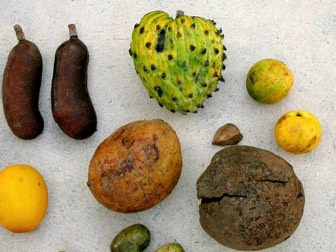](/gallery/ "Megafauna fruits")

  **[Megafauna fruits](/gallery/ "Megafauna fruits")**
- [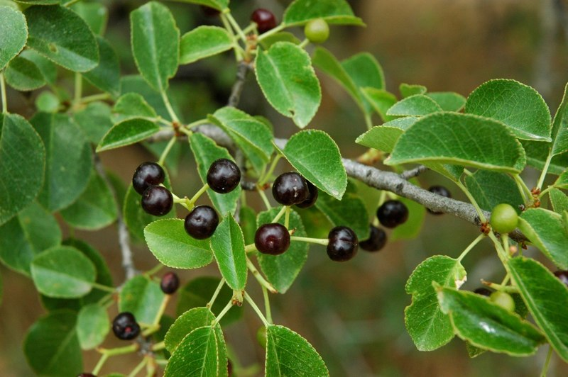](/gallery/ "Prunus")

  ***[Prunus mahaleb](/gallery/ "Prunus")***
- [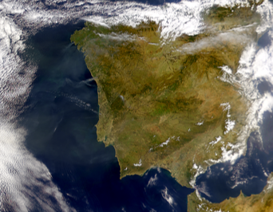](/gallery/ "Study sites")

  **[Study sites](/gallery/ "Study sites")**
- [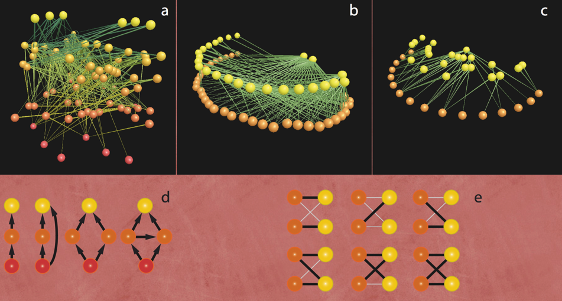](/gallery/ "Networks")

  **[Networks](/gallery/ "Networks")**
- [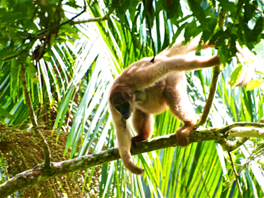](/gallery/ "Brazil")

  

  **[Brazil](/gallery/ "Brazil")**
- [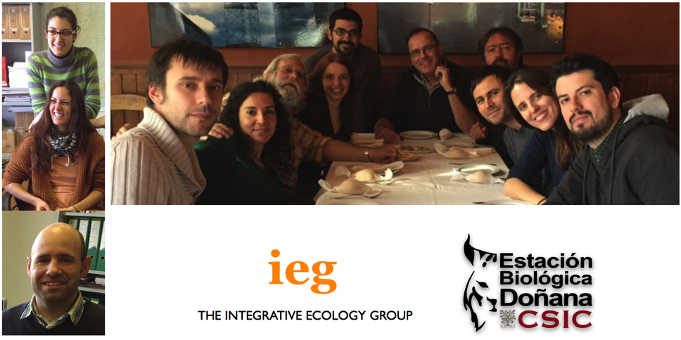](/gallery/ "IEG")

  

  **[The Lab](/gallery/ "IEG")**
- [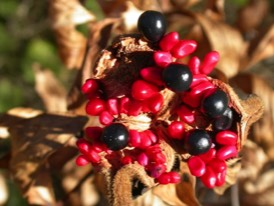](/gallery/ "Fruits, flowers")

  

  **[Fruits, flowers](/gallery/ "Fruits, flowers")**
- [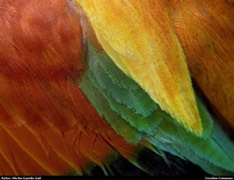](/gallery/ "Bird photos")

  

  **[Birds](/gallery/ "Bird photos")**
- [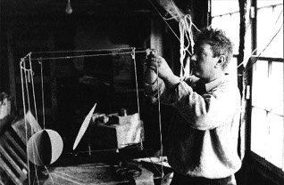](/gallery/ "Art")

  

  **[Art](/gallery/ "Art")**

####

---

## Gallery-Bird photos

Birds

Some bird photos. See more at [500px-Pedro Jordano](https://500px.com/pedrojordano/).

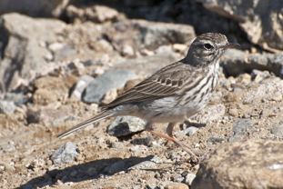

Berthelot's Pipit Anthus berthelotii Bisbita Caminero

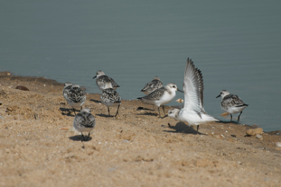

Sanderling Calidris alba Correlimos Tridáctilo

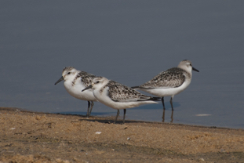

Sanderling Calidris alba Correlimos Tridáctilo

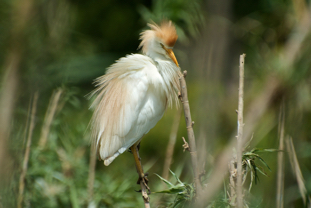

Cattle Egret Bubulcus ibis Garcilla Bueyera

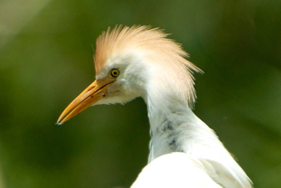

Cattle Egret Bubulcus ibis Garcilla Bueyera

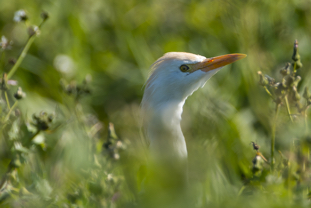

Cattle Egret (ibis) Bubulcus ibis ibis Garcilla Bueyera

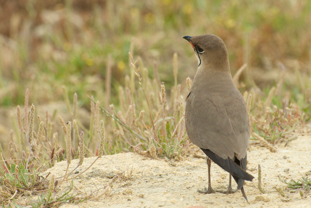

Collared Pratincole Glareola pratincola Canastera Común

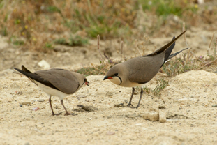

Collared Pratincole Glareola pratincola Canastera Común

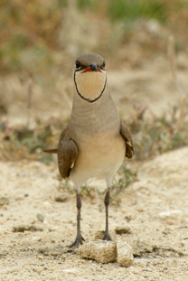

Collared Pratincole Glareola pratincola Canastera Común

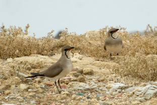

Collared Pratincole Glareola pratincola Canastera Común

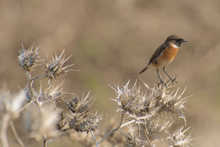

Stonechat (European) Saxicola rubicola Tarabilla común

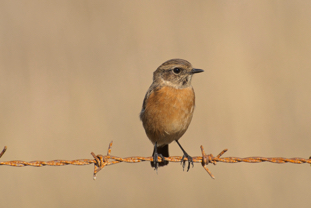

Stonechat (European) Saxicola rubicola Tarabilla común

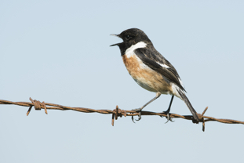

Whinchat Saxicola rubicola Tarabilla común

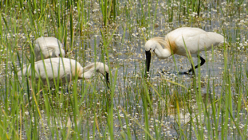

Eurasian Spoonbill Platalea leucorodia Espátula Común

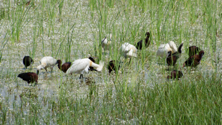

Eurasian Spoonbill Platalea leucorodia Espátula Común

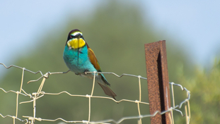

European Bee-eater Merops apiaster Abejaruco Europeo

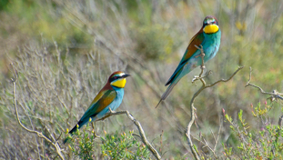

European Bee-eater Merops apiaster Abejaruco Europeo

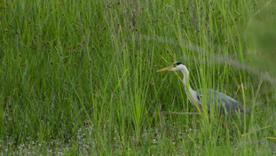

Gray Heron Ardea cinerea Garza Real

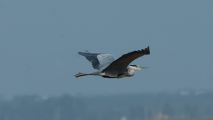

Gray Heron Ardea cinerea Garza Real

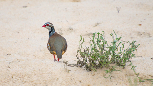

Red-legged Partridge Alectoris rufa Perdiz Roja

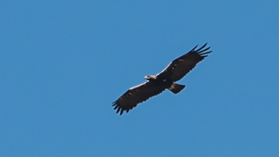

Spanish Eagle Aquila adalberti Águila Imperial Ibérica

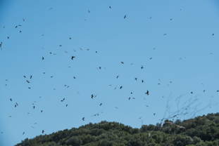

Black Kite (Black) Milvus migrans [migrans Group] Milano negro

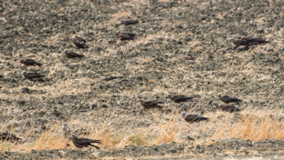

Black Kite (Black) Milvus migrans [migrans Group] Milano negro

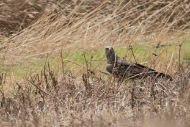

Black Kite (Black) Milvus migrans [migrans Group] Milano negro

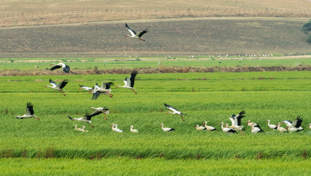

White Stork Ciconia ciconia Cigüeña Blanca

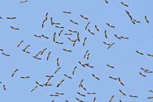

White Stork Ciconia ciconia Cigüeña Blanca

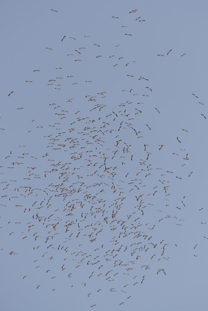

White Stork Ciconia ciconia Cigüeña Blanca

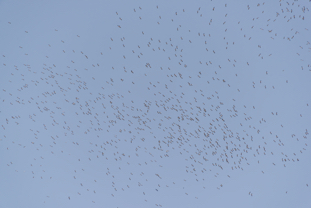

White Stork Ciconia ciconia Cigüeña Blanca

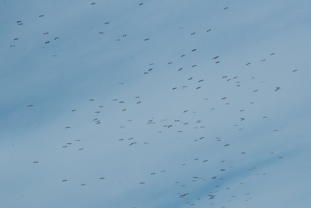

White Stork Ciconia ciconia Cigüeña Blanca

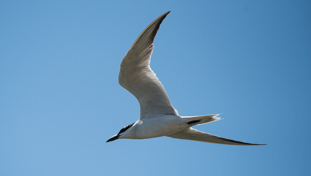

Gull-billed Tern Gelochelidon nilotica Pagaza Piconegra

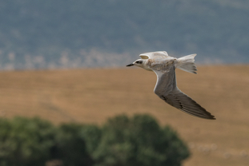

Gull-billed Tern Gelochelidon nilotica Pagaza Piconegra

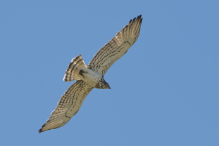

Short-toed Eagle Circaetus gallicus Culebrera Europea

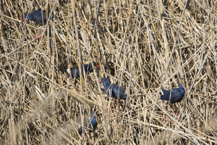

Purple Swamphen Porphyrio porphyrio Calamón Común

####

---

## Networks

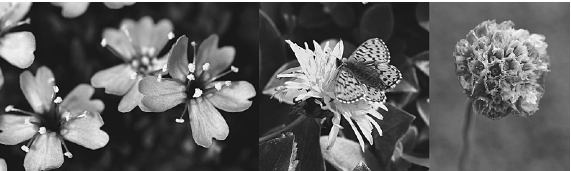

####

---

## Megafauna fruits

#### Megafauna fruits

A collection of megafauna fruits and seeds. Herbarium Museu Goeldi, Belém, Pará, Brazil. These photos accompany our study in PLoS One:  
  
Guimarães Jr, P., Galetti, M. and Jordano, P. 2008. Seed dispersal anachronisms: rethinking the fruits extinct megafauna ate. PLOS One, 3(3): e1745.  
doi:10.1371/journal.pone.0001745.  
  
The label in the photos is approx. 10 cm wide.

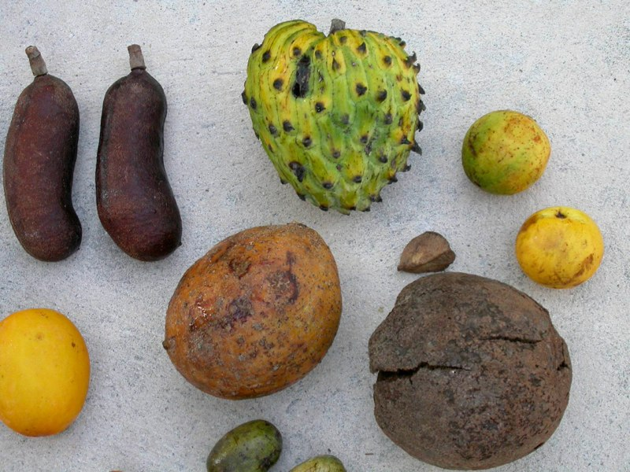

Fruits from Fazenda Rio Negro, Pantanal, Brazil.

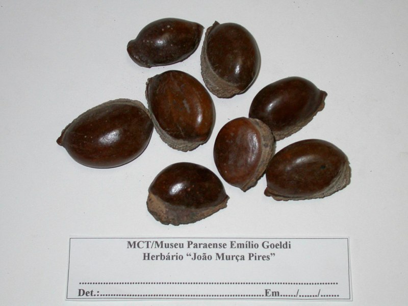

*Pouteria macrocarpa*. Sapotaceae

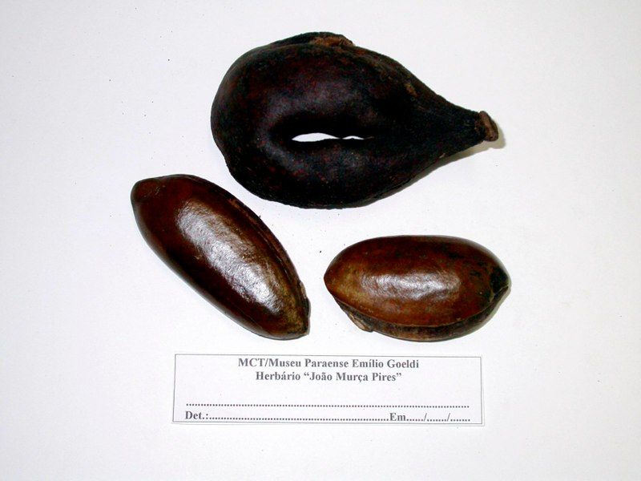

*Pouteria ucucui*. Sapotaceae

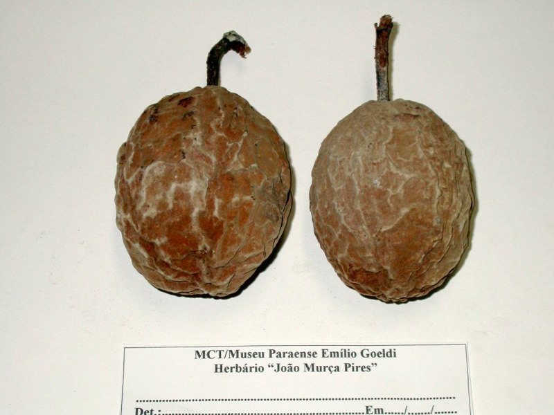

*Theobroma speciosa*. Malvaceae

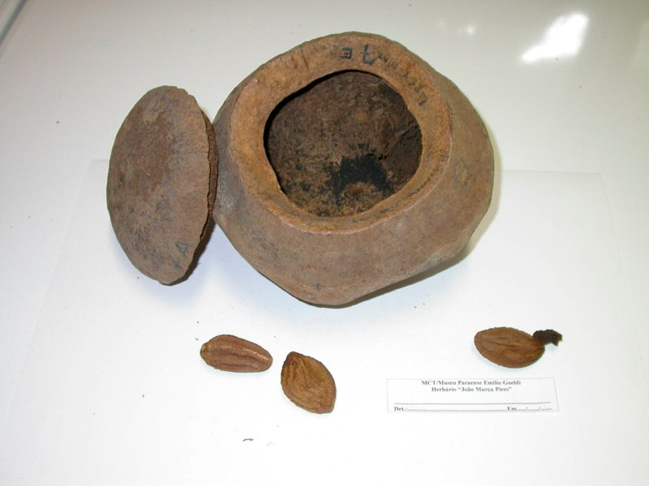

Lecythidaceae

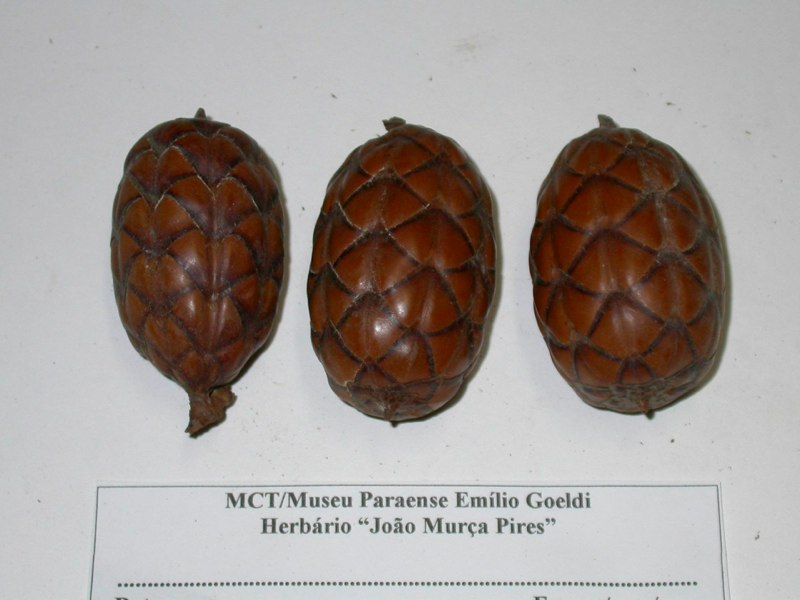

*Raphia vinifera*. Arecaceae

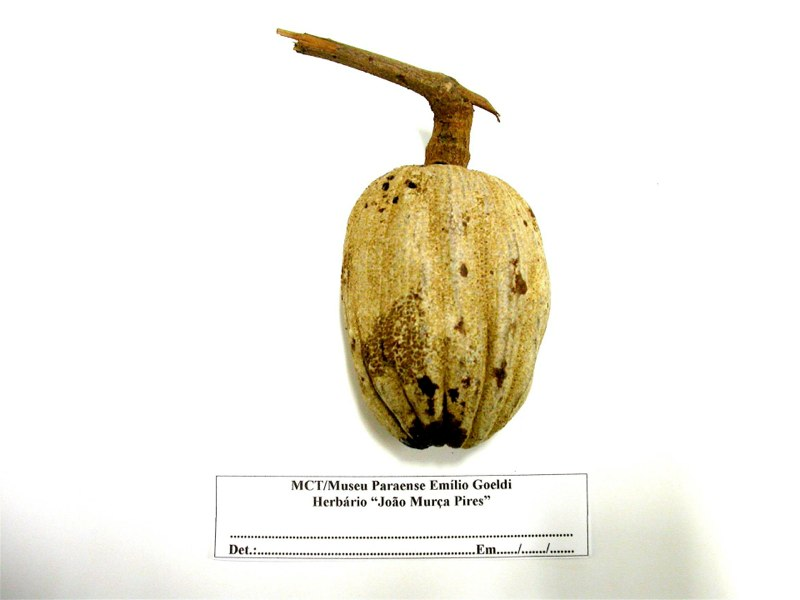

*Lacunaria jemmani*. Quiinaceae

*Parinari montana*. Chrysobalanaceae

*Licania macrophyla*. Chrysobalanaceae

*Pouteria pariry*. Sapotaceae

*Theobroma grandiflora*. Malvaceae

*Theobroma grandiflora*. Malvaceae

*Scheelea martiana*. Arecaceae

*Orbignya phalerata*. Arecaceae

*Phytelephas macrocarpa*. Arecaceae

Megafauna fruits from Pantanal (Fazenda Rio Negro), Brazil.

####

---

## Gallery-Prunus mahaleb

*Prunus mahaleb* at the study site in Nava de las Correhuelas, Parque Natural de las Sierras de Cazorla, Segura y Las Villas, Jaén, Spain. 1615 m elevation.

Previous Slide Next Slide

####

---

## Study Sites

### Study sites gallery

These are my main study sites. Most of my fieldwork is carried out at [Parque Natural de las Sierras de Cazorla, Segura y Las Villas (Jaén)](http://www.juntadeandalucia.es/medioambiente/servtc5/ventana/resultadoEspacios.do?lg=EN), in the eastern area of Andalucia (additional information- in english- here), and [Doñana National Park](http://www.juntadeandalucia.es/medioambiente/servtc5/ventana/resultadoEspacios.do?lg=EN). I also collaborate with José M. Gómez from Grupo de Ecología Terrestre, Univ. Granada, who works chiefly at [Parque Nacional de Sierra Nevada and P.N. Sierra de Baza (Granada)](http://www.juntadeandalucia.es/medioambiente/servtc5/ventana/busquedaEspacios.do?lg=EN). Together with Juan Arroyo, I collaborate with projects at [Parque Natural de los Alcornocales (Cádiz)](https://maps.google.com/maps?ll=36.72216,-5.174561&z=9&t=p&hl=es&gl=US&mapclient=apiv3&cid=3730229441314714204). More recently, we have started projects in the Canary Islands (PI Alfredo Valido) and north Extremadura (PI Arndt Hampe).

---

- 
- 
- 
- 
- 
- 
- 
- 
- 
- 

- [Next](/gallery/#0)
- [Prev](/gallery/#0)

[Close](/gallery/#0)

#### Doñana

- 
- 
- 
- 
- 
- 
- 
- 
- 
- 

- [Next](/gallery/#0)
- [Prev](/gallery/#0)

[Close](/gallery/#0)

#### Islas Canarias

- 
- 
- 
- 
- 
- 
- 
- 
- 
- 

- [Next](/gallery/#0)
- [Prev](/gallery/#0)

[Close](/gallery/#0)

#### Cazorla

- 
- 
- 
- 
- 
- 

- [Next](/gallery/#0)
- [Prev](/gallery/#0)

[Close](/gallery/#0)

#### Ilha do Cardoso, Brazil

- 
- 
- 
- 
- 
- 

- [Next](/gallery/#0)
- [Prev](/gallery/#0)

[Close](/gallery/#0)

#### Alcornocales

---

####

---

## Brazil

####

---

## IEG

####

---

## Art

####

---

## Fruits, flowers

####
