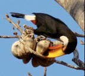

---

+ [Paper](/papers/)
+ [DOI: 10.3732/ajb.1000069](https://doi.org/10.3732/ajb.1000069)

---

##### Citation

Schupp, E. W., Jordano, P. and Gómez, J.M. 2010. Seed dispersal effectiveness revisited: a conceptual review. New Phytologist 188: 333-353. This is a Tansley Review for New Phytologist.

---

##### Notes

 99. Arroyo, J.M., Rigueiro, C., Rodríguez, R., Hampe, A., Valido, A., Rodríguez-Sánchez, F. and Jordano, P. 2010. Isolation and characterization of 20 microsatellite loci for laurel species (gen. Laurus, Lauraceae). American Journal of Botany [AJB Primer Notes & Protocols]: e26-e30. doi:10.3732/ajb.1000069

 98. Jordano, P. 2010. Coevolution in multi-specific interactions among free-living species. Evolution: Education and Outreach 3: 40-46. [EEOu Special issue on Coevolution]

---

##### Figure

