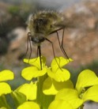

---

+ [Paper](/pdfs/Olesen_etal_2011_PRSB_Forbidden_links.pdf)
+ [DOI: 10.1016/j.revpalbo.2010.03.008](https://doi.org/10.1016/j.revpalbo.2010.03.008)

---

##### Citation

Gómez, J.M., Jordano, P. and Perfectti, F. 2011.The functional consequences of mutualistic network architecture. *PLoS One*, 6(1): e16143.

---

##### Notes

2010

 106. Rodríguez-Sánchez, F., Hampe, A., Jordano, P. and Arroyo, J. 2010. Past tree range dynamics in the Iberian Peninsula inferred through phylogeography and palaeodistribution modelling: A review. Review of Palaeobotany and Palynology 162: 507-521.doi:10.1016/j.revpalbo.2010.03.008

 105. Jordano, P. and Galetti, M. 2010. Curso Latino Americano de frugivoría y dispersión de semillas. Ecosistemas 19 (3): 89-93. Septiembre 2010. Brief presentation and overview of the 2010 field course.

 104. Verdú, M., Jordano, P. and Valiente-Banuet, A. 2010.The phylogenetic structure of plant facilitation networks changes with competition. Journal of Ecology 98: 1454–1461.

---

##### Figure

