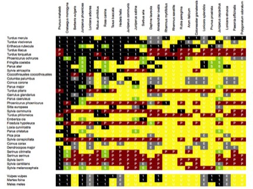

---

+ [Paper](/pdfs/Olesen_etal_2011_PRSB_Forbidden_links.pdf)

---

##### Citation

Olesen, J.M., Bascompte, J., Dupont, Y.L., Elberling, H. and Jordano, P. 2011. Missing and forbidden links in mutualistic networks. *Proceedings of the Royal Society of London Series B-Biological Sciences*, 278: 725-732. doi: [10.1098/rspb.2010.1371](http://rspb.royalsocietypublishing.org/content/278/1706/725.abstract)

---

##### Figure

