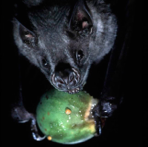

---

+ [Paper](/pdfs/Mello_etal_2011_PLoSOne.pdf)

---

##### Citation

Mello, M.A.R., Marquitti, F.M.D., Guimarães Jr., P.R., Kalko, E.K.V., Jordano, P. and Aguiar, M.A.M. 2011. The missing part of seed dispersal networks: structure and robustness of bat-fruit interactions. *PLoS One* 6(2): e17395. doi:[10.1371/journal.pone.0017395](http://www.plosone.org/article/info%3Adoi%2F10.1371%2Fjournal.pone.0017395)

---

##### Figure

