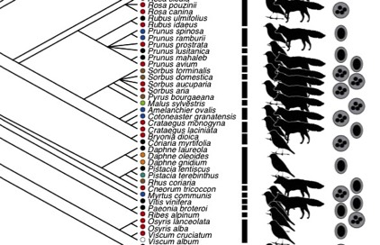

---

+ [Paper](/pdfs/Valido_etal_2011_JEvoBio_Fruit_integration_Mediterranean.pdf)

---

##### Citation

Valido, A., Schaefer, H.M. and Jordano, P. 2011.Colour, design, and reward: phenotypic integration of fleshy fruit displays. *Journal of Evolutionary Biology* 24: 751-760. doi: [10.1111/j.1420-9101.2010.02206.x](http://onlinelibrary.wiley.com/doi/10.1111/j.1420-9101.2010.02206.x/abstract)

---

##### Figure

