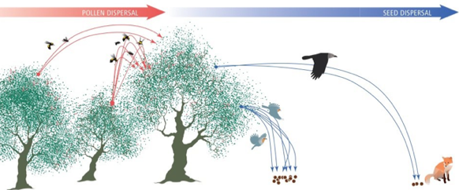

---

+ [Paper](/pdfs/Schupp_2011_Molecular_Ecology_The_full_path_of_Janzen-Connell_effects_genetic_tracking_of_seeds_to_adult_plant_recruitment.pdf)

---

##### Citation

Schupp, E.W. and Jordano, P. 2011.The full path of Janzen-Connell effects: genetic tracking of seeds to adult plant recruitment. *Molecular Ecology* 20: 3953-3955. doi: [10.1111/j.1365-294X.2011.05202.x](http://onlinelibrary.wiley.com/doi/10.1111/j.1365-294X.2011.05202.x/full)

---

##### Figure

