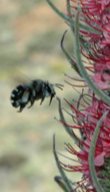

---

+ [Paper](/pdfs/Valido_etal_2011_Impacto_Apis_interacciones_planta-polinizadores_Teide_OAPN.pdf)

---

##### Citation

Valido, A., Rodríguez-Rodríguez, M.C., and Jordano, P. (2011). Interacciones entre plantas y polinizadores en el Parque Nacional del Teide: consecuencias ecológicas de la introducción masiva de la abeja doméstica (*Apis mellifera*, Apidae). Pp.: 205-231 in MMARM (ed.). Proyectos de investigacion en Parques Nacionales. MARM, Madrid.

---

##### Figure

