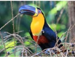

---

+ [Paper](/pdfs/Galetti_etal_2013_Science.pdf)
+ [DOI: 10.1126/science.1233774](https://doi.org/10.1126/science.1233774)

---

##### Citation

Galetti M., Guevara R., Côrtes M., Fadini R., Von Matter S., Leite A.B., Labecca F., Ribeiro T., Carvalho C., Collevatti R.G., Pires M.M., Guimarães Jr. P.R., Brancalion P.H., Ribeiro M.C., Jordano P. 2013. Functional extinction of birds drives rapid evolutionary changes in seed size. *Science* 340 (6136): 1086-1090. doi: 10.1126/science.1233774. Photo: Guto Balieiro. Black-billed toucan *Ramphastos vitellinus* ssp. *ariel* on *Euterpe edulis* fruits.

---

##### Figure

