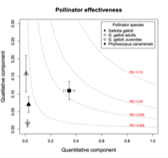

---

+ [Paper](/pdfs/Rodriguez_Isoplexis_pollination-effectiveness_Oecologia_2013.pdf)
+ [DOI: 10.1007/s00442-013-2606-y](https://doi.org/10.1007/s00442-013-2606-y)

---

##### Citation

Rodríguez-Rodríguez, M.C., Jordano, P., and Valido, A. 2013. Quantity and quality components of effectiveness in insular pollinator assemblages. *Oecologia* 173: 179-190. doi: 10.1007/s00442-013-2606-y

---

##### Figure

