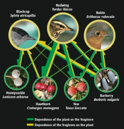

---

+ [DOI: 10.1098/rsbl.2013.1000](https://doi.org/10.1098/rsbl.2013.1000)

---

##### Citation

Heleno, R., García, C., Jordano, P., Traveset, A., Gómez, J.M., Blüthgen, N., Memmott, J., Moora, M., Cerdeira, J., Rodríguez-Echeverría, S., Freitas, H., Olesen, J.M. 2014. Ecological networks: delving into the architecture of biodiversity. *Biology Letters* 10: 20131000. doi:10.1098/rsbl.2013.1000 1744-957X

---

##### Notes

126. Bascompte, J. and Jordano, P. 2014. *Mutualistic networks*. Monographs in Population Biology Series, no. 53. Princeton University Press, Princeton, USA. ISBN: 9780691131269 [Link to PUP web page](http://press.princeton.edu/titles/10161.html). The preface [] and Chapter 1 [] are available. [In Amazon](http://www.amazon.com/Mutualistic-Networks-Monographs-Population-Biology-ebook/dp/B00F8MIJGC/ref=sr_1_1?s=digital-text&ie=UTF8&qid=1387401591&sr=1-1&keywords=Mutualistic+networks).  Nominated by the British Ecological Society for the [BES Marsh Ecology Book of the Year Award, 2016](http://pjordanolab.ebd.csic.es/papers/Our book ). Honored sharing this with three other titles.

Mutualistic interactions among plants and animals have played a paramount role in shaping biodiversity. Yet the majority of studies on mutualistic interactions have involved only a few species, as opposed to broader mutual connections between communities of organisms. Mutualistic Networks is the first book to comprehensively explore this burgeoning field. Integrating different approaches, from the statistical description of network structures to the development of new analytical frameworks, we describe the architecture of these mutualistic networks and show their importance for the robustness of biodiversity and the coevolutionary process. Making a case for why we should care about mutualisms and their complex networks, this book offers a new perspective on the study and synthesis of this growing area for ecologists and evolutionary biologists.

---

##### Figure

