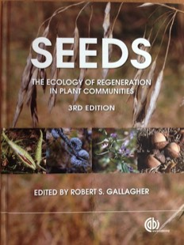

---

##### Citation

Jordano, P. 2014. Fruits and frugivory. In: Gallagher, R.S. (ed.). *Seeds: the ecology of regeneration of plant communities*. 3rd edition, pp.: 18-61. CABI, Wallingford, UK. ISBN-13: 978 1 78064 183 6

---

##### Figure

