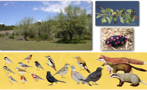

---

+ [Paper](/pdfs/Herrera&Jordano_1981_EcolMonogrHQ.pdf)

---

##### Citation

Herrera, C. M. and P. Jordano. 1981. *Prunus mahaleb* and birds: the high efficiency seed dispersal system of a temperate fruiting tree. Ecological Monographs 51: 203-21.

---

##### Notes

Very early work (1980-1983)

**These papers were written during graduation (except #1-3).**

12. López-Jurado L.F., Jordano, P., Ruiz, M. 1978. Ecología de una población insular mediterránea del Eslizón Ibérico, Chalcides bedriagai (Sauria, Scincidae). Doñana Acta Vertebrata 5: 19-34.

11. Jordano P., López-Jurado, L.F., Ruiz, M. 1980. Mecanismos de regulación de la temperatura corporal en el Eslizón Ibérico (*Chalcides bedriagai*). Actas I Reunión Iberoamericana de Zoología de Vertebrados, pages 379-384.

10. Torres J.A., Jordano, P., Villasante, J. 1980. Estructura y dinámica temporal de una colonia de Buitre Negro, *Aegypius monachus*, en Sierra Morena central (Córdoba). Boletín de la Estación Central de Ecología 9: 67-72.

9. Jordano, P. 1981. Relaciones interespecíficas y coexistencia entre el Aguila Real (*Aquila chrysaetos*) y el Aguila Perdicera (*Hieraaetus fasciatus*) en Sierra Morena central. Ardeola 28: 67-88.

8. Jordano, P. y Torres, J.A. 1981. Importancia de la estructura de la vegetación en la selección del hábitat para la nidificación en una comunidad de rapaces diurnas mediterráneas Ardeola 28: 51-66.

7. Jordano, P. 1981. Alimentación y relaciones tróficas entre los paseriformes en paso otoñal por una localidad de Andalucía central.Doñana Acta Vertebrata 8: 103-124.

6. Torres, J.A., Jordano, P., León, A. 1981. Aves de presa diurnas de la provincia de Córdoba. Publ. Monte de Piedad y Caja de Ahorros de Córdoba. 130 pages.

5. Jordano, P. 1983. Correlaciones ecológicas del consumo de frutos por los paseriformes durante la migración otoñal. Alytes 1: 55-70.

4. Torres, J.A., Jordano, P., y León, A. 1984. Aves acuáticas de las lagunas y embalses de la provincia de Córdoba. Axerquía 12: 281-284.

3. Jordano, P. 1985. El ciclo anual de los paseriformes frugívoros en el matorral mediterráneo del sur de España: importancia de su invernada y variaciones interanuales. Ardeola 32: 69-94.

2. Jordano, P. 1984. Relaciones entre plantas y aves frugívoras en el matorral mediterráneo del área de Doñana. PhD Thesis. Publicaciones Tesis Doctorales y Tesinas, Universidad de Sevilla, Sevilla. Accesible here: [idUS, Univ. Sevilla Repository](https://idus.us.es/handle/11441/70423).

1. Jordano, P. 1987. Notas sobre la dieta no-insectívora de algunos Muscicapidae. Ardeola 34: 89-98.

Open all

---

##### Figure

