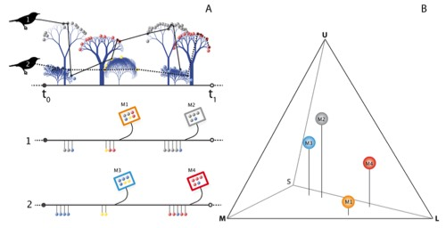

---

+ [Paper](/pdfs/Schaefer_etal_2014_PRSB_Fruit_colors.pdf)
+ [DOI: 10.1098/rspb.2013.2516](https://doi.org/10.1098/rspb.2013.2516)

---

##### Citation

Schaefer, H.M., Valido, A., Jordano, P. 2014. Birds see the true colours of fruits to live off the fat of the land. *Proceedings of the Royal Society, B*, 281(1777): 20132516. doi: 10.1098/rspb.2013.2516

---

##### Figure

