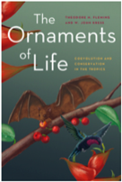

---

+ [Paper](/pdfs/Jordano_2014_BioScience_Ornaments_recension.pdf)

---

##### Citation

Jordano, P. 2014. Biotic interactions as Nature’s ornaments: a view from the tropics. *BioScience* 64: 630-631. [A recension of the book: T.H. Fleming & W.J. Kress (2013) *The Ornaments of Life. Coevolution and Conservation in the Tropics*. Chicago University Press, Chicago, IL. ISBN: 9780226253404]

---

##### Figure

