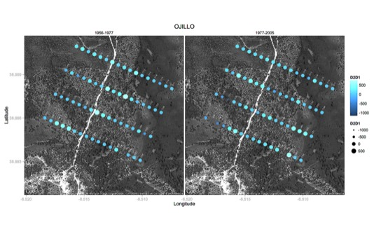

---

+ [Paper](/pdfs/Garcia_etal_2014_JEcology_JuniperusSpatialDynamics.pdf)
+ [DOI: 10.1111/1365-2745.12297](https://doi.org/10.1111/1365-2745.12297)

---

##### Citation

Garcia C., Moracho E., Diaz-Delgado R. and Jordano P. 2014. Natural regeneration and population expansion of an endozoochorous species: a spatio-temporal approach. *Journal of Ecology*, 102: 1562–1571. doi: 10.1111/1365-2745.12297

---

##### Notes

 134. González-Varo JP, Arroyo JM, Jordano P. 2014. Finding the bird that dispersed the seeds. Barcode Bulletin 5, 10–11.

 133. Dehling, D.M., Töpfer, T., Schaefer, H.M., Jordano, P., Böhning-Gaese, K. and Schleuning, M. 2014. Functional relationships beyond species richness patterns: trait matching in plant-bird mutualisms across scales. *Global Ecology and Biogeography* 23: 1085-1093. doi: 10.1111/geb.12193

---

##### Figure

