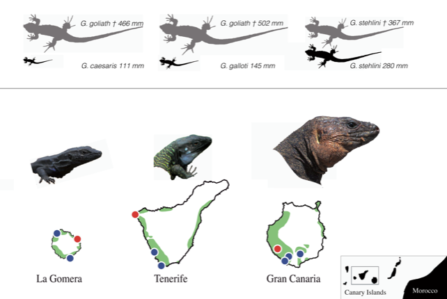

---

+ [Paper](/pdfs/Perez-Mendez_etal_2016_Defaunation_Scientific_Reports.pdf)
+ [DOI: 10.1038/srep24820](https://doi.org/10.1038/srep24820)

---

##### Citation

Pérez-Méndez, N., Jordano, P., García, C., and Valido, A. 2016. The signatures of Anthropocene defaunation: cascading effects of the seed dispersal collapse. Scientific Reports, 6: 24820. [doi: 10.1038/srep24820](http://www.nature.com/articles/srep24820)  

---

##### Figure

