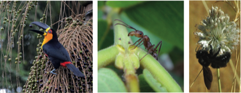

---

+ [DOI: 10.1371/journal.pbio.1002559](https://doi.org/10.1371/journal.pbio.1002559)

---

##### Citation

Jordano, P. 2016. Chasing ecological interactions [Invited commentary, **[Research Matters](http://collections.plos.org/research-matters-biology)** section]. *PLoS Biology*, 14(9): e1002559. [doi:10.1371/journal.pbio.1002559](http://journals.plos.org/plosbiology/article?id=10.1371/journal.pbio.1002559) 

---

##### Figure

