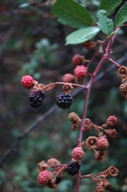

---

+ [Paper](/pdfs/Jordano_1982_Oikos_Dispersal_Rubus_ulmifolius.pdf)

---

##### Citation

Jordano, P. 1982. Migrant birds are the main seed dispersers of blackberries in southern Spain. Oikos 38: 183-193.

---

##### Figure

