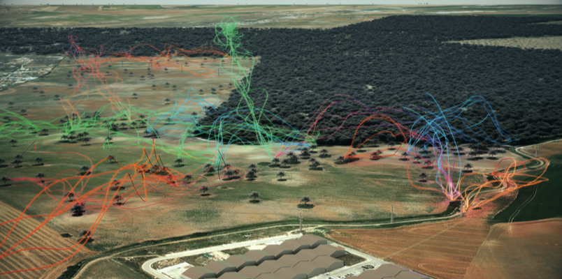
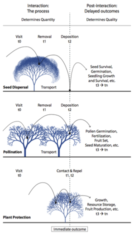

---

+ [Paper](/pdfs/Schupp_et_al-2017-Ecology_Letters.pdf)

---

##### Citation

Schupp E.W., Jordano P. and Gómez J.M. 2017. A general framework for effectiveness concepts in plant-animal mutualisms. Ecology Letters 20: 577–590. *[Ideas and Perspectives]*doi: [10.1111/ele.12764](http://onlinelibrary.wiley.com/doi/10.1111/ele.12764/full)

---

##### Figure

