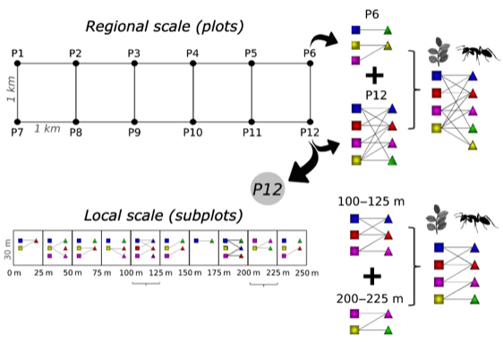

---

+ [Paper](/pdfs/Dattilo_etal-2019-Journal_of_Animal_Ecology.pdf)

---

##### Citation

Dáttilo, W.; Vizentin-Bugoni, J.; Debastiani, V.; Jordano, P.; Izzo, T.J. 2019. The influence of spatial sampling scales on ant-plant interaction network architecture. Journal of Animal Ecology 88: 903-914.

---

##### Figure

