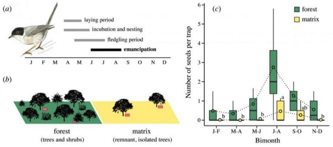

---

+ [Paper](/pdfs/Gonzalez-Varo_etal_2019_BiolLett.pdf)
+ [DOI: 10.1098/rsbl.2019.0264](https://doi.org/10.1098/rsbl.2019.0264)

---

##### Citation

González-Varo, J.P., Díaz-García, S., Arroyo, J.M., Jordano, P. 2019. Seed dispersal by dispersing juvenile animals: a source of functional connectivity in fragmented landscapes. Biology Letters 15 (7), 20190264.

---

##### Figure

