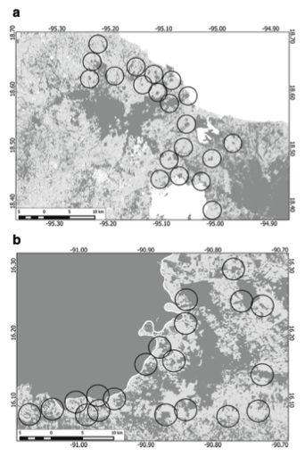

---

+ [Paper](/pdfs/San-Jose_etal_2019_LandscapeEcol.pdf)
+ [DOI: 10.1007/s10980-019-00821-y](https://doi.org/10.1007/s10980-019-00821-y)

---

##### Citation

San-José, M., Arroyo-Rodríguez, V., Jordano, P., Meave, J.A. & Martínez-Ramos, M. (2019). The scale of landscape effect on seed dispersal depends on both response variables and landscape predictor. Landscape Ecol, 34, 1069–1080.Doi: [10.1007/s10980-019-00821-y](https://doi.org/10.1007/s10980-019-00821-y)

---

##### Figure

