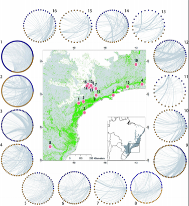

---

+ [Paper](/pdfs/Emer_etal_2020_biotropica.pdf)
+ [DOI: 10.1111/btp.12738](https://doi.org/10.1111/btp.12738)

---

##### Citation

Emer, C., Jordano, P., Pizo, M.A., Ribeiro, M.C., Silva, F.R. & Galetti, M. (2020). Seed dispersal networks in tropical forest fragments: Area effects, remnant species, and interaction diversity. Biotropica, 52, 81–89.

---

##### Notes

Doi: [10.1111/btp.12738](https://doi.org/10.1111/btp.12738)

2019

---

##### Figure

