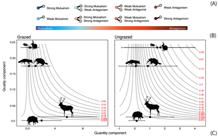

---

+ [Paper](/pdfs/Jacome-Flores_et_al-2020-Oikos.pdf)
+ [DOI: 10.1111/oik.06688](https://doi.org/10.1111/oik.06688)

---

##### Citation

Jácome-Flores M.E., Pizo, M.A., Jordano P., Delibes M., Fedriani J. M. 2020. Interaction motifs variability in a Mediterranean palm under environmental disturbances: the mutualism-antagonism continuum. Oikos 129: 367-379. Doi: [10.1111/oik.06688](https://doi.org/10.1111/oik.06688)

---

##### Figure

