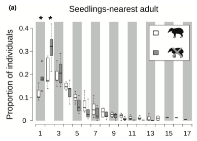

---

+ [Paper](/pdfs/Valverde_etal_2020_Biotropica_Euterpe_spatial_recruitment.pdf)
+ [DOI: 10.1111/btp.12873](https://doi.org/10.1111/btp.12873)

---

##### Citation

Valverde, J., Carvalho, C.S., Jordano, P., Galetti, M. 2020. Large herbivores regulate the spatial recruitment of a hyperdominant Neotropical palm. Biotropica 53:286–295.

---

##### Figure

