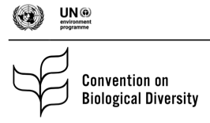

---

+ [Paper](/pdfs/Diaz_et_al._2020._ConventionBiolDiversity_inf-09-en.pdf)

---

##### Citation

S Díaz, W Broadgate, F Declerck, S Dobrota, C Krug, H Moersberg, ... 2020. Synthesizing the scientific evidence to inform the development of the post-2020 Global Framework on Biodiversity. Twenty-fourth meeting, Subsidiary Body on Scientific, Technical and …

---

##### Figure

