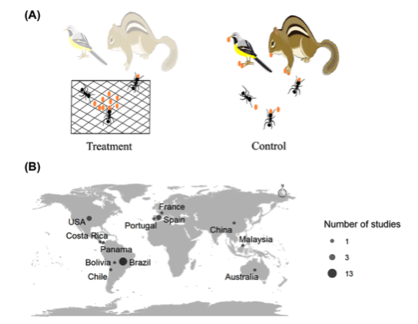

---

+ [Paper](/pdfs/Anjos_et_al_2020_Oikos_Ants_as_diaspore_removers.pdf)
+ [DOI: 10.1111/oik.06940](https://doi.org/10.1111/oik.06940)

---

##### Citation

Anjos, D.V., Leal, L.C., Jordano, P., Del-Claro, K. 2020. Ants as diaspore removers of non‐myrmecochorous plants: a meta‐analysis. Oikos 129: 775–786.

---

##### Figure

