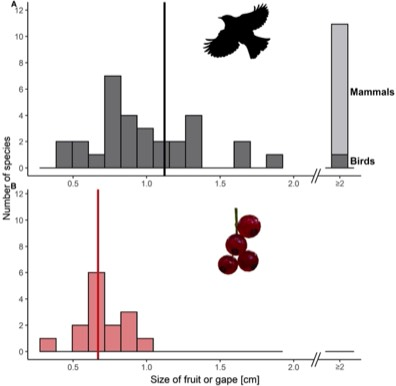

---

+ [Paper](/pdfs/Rehling_etal_2021_Frontiers_Ecol_Evol_Fruit_size_mismatches.pdf)
+ [DOI: 10.1101/2021.09.18.460873](https://doi.org/10.1101/2021.09.18.460873)

---

##### Citation

Finn Rehling, Bogdan Jaroszewicz, Leonie Victoria Braasch, Jörg Albrecht, Pedro Jordano, Jan Schlautmann, Nina Farwig and Dana G. Schabo. 2021. Within-species trait variation can lead to size limitations in seed dispersal of small-fruited plants. Frontiers in Ecology and Evolution, 00: 000-000. In press.

---

##### Notes

Doi: [10.1101/2021.09.18.460873](https://doi.org/10.1101/2021.09.18.460873)

---

##### Figure

