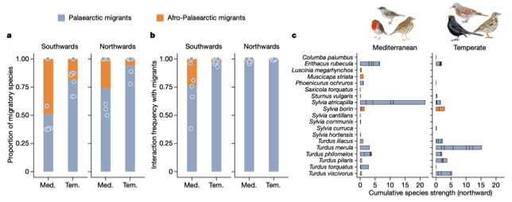

---

+ [Paper](/pdfs/Gonzalez-Varo_etal_2021_Nature.pdf)
+ [DOI: 10.1038/s41586-021-03665-2](https://doi.org/10.1038/s41586-021-03665-2)

---

##### Citation

González-Varo, J.P., Rumeu, B., Albrecht, J., Arroyo, J.M., Bueno, R.S., Burgos, T., da Silva, L.P., Escribano-Ávila, G., Farwig, N., García, D., Heleno, R-H., Illera, J.C., Jordano, P., Kurek, P., Simmons, B.I., Virgós, E., Sutherland, W.J., Traveset, A. 2021. Limited potential for bird migration to disperse plants to cooler latitudes. Nature 595 (7865): 75-79. doi: [10.1038/s41586-021-03665-2]( https://doi.org/10.1038/s41586-021-03665-2)

---

##### Notes

Highlighted in NATURE by Barnabas H. Daru: [Migratory birds aid the redistribution of plants to new climates](https://www.nature.com/articles/d41586-021-01547-1)

Highlighted in NATURE CLIMATE CHANGE by Tegan Armarego-Marriott: [Bird-plant dispersal limits](https://www.nature.com/articles/d41586-021-01547-1)

---

##### Figure

