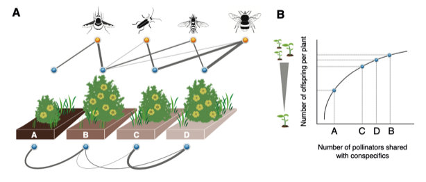

---

+ [Paper](/pdfs/Arroyo‐Correa_etal_2021_JEcology_Individual‐based_plant_pollinator_networks.pdf)
+ [DOI: 10.1111/1365-2745.13694](https://doi.org/10.1111/1365-2745.13694)

---

##### Citation

Arroyo-Correa, B., Bartomeus, I., Jordano, P. 2021. Individual-based plant–pollinator networks are structured by phenotypic and microsite plant traits. *Journal of Ecology* 109: 2832-2844.

---

##### Figure

