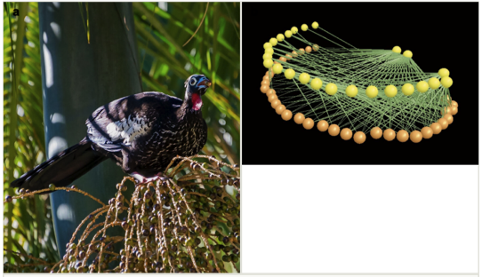

---

+ [Paper](/pdfs/Jordano_2021_BISS_The_biodiversity_of_ecologicl_interactions.pdf)
+ [DOI: 10.3897/biss.5.75564](https://doi.org/10.3897/biss.5.75564)

---

##### Citation

Jordano, P. 2021. The Biodiversity of ecological interactions: challenges for recording and documenting the Web of Life. Biodiversity Information Science and Standards 5: e75564.

---

##### Figure

