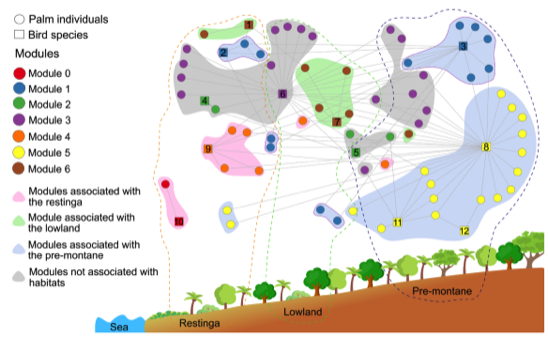

---

+ [Paper](/pdfs/Dallas&Jordano_2021_PhilRSocB_Helmiths.pdf)
+ [DOI: 10.1111/oik.08384](https://doi.org/10.1111/oik.08384)

---

##### Citation

Friedemann, P., Corrêa-Côrtes, M., de Castro, E.R., Galetti, M., Jordano, P., Guimarães Jr., P.R. 2022. The individual-based network structure of palm-seed dispersers is explained by a rainforest gradient. Oikos 2022: e08384.

---

##### Figure

