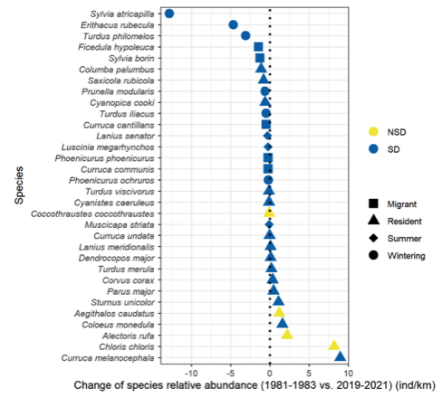

---

+ [Paper](/pdfs/Campo‐Celada_etal_2022_Oikos_Assessing_short_and_long‐term_variations_in_diversity,_timing_a3abc9ea.pdf)
+ [DOI: 10.1111/oik.08387](https://doi.org/10.1111/oik.08387)

---

##### Citation

Campo-Celada, M., Jordano, P., Benítez-López, A., Gutiérrez-Expósito, C., Rabadán-González, J., Mendoza, I. 2022. Assessing short and long-term variations in diversity, timing and body condition of frugivorous birds. Oikos 00: 000-000.

---

##### Figure

