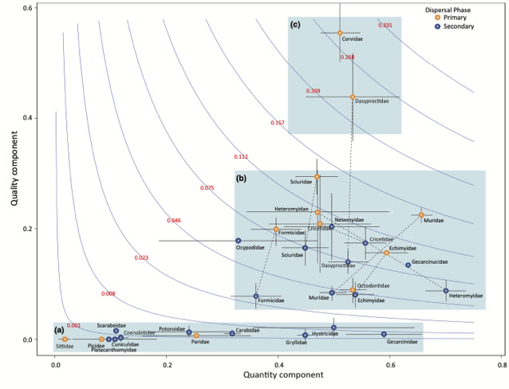

---

+ [Paper](/pdfs/Gomez_etal_2022_EcolLett_The_ecological_and_evolutionary_significance_of_effectiveness_landscapes.pdf)
+ [DOI: 10.1111/ele.13939](https://doi.org/10.1111/ele.13939)

---

##### Citation

Gómez, J.M., Schupp, E.W., Jordano, P. 2022. The ecological and evolutionary significance of effectiveness landscapes in mutualistic interactions. Ecology Letters 25: 264–277.

---

##### Figure

