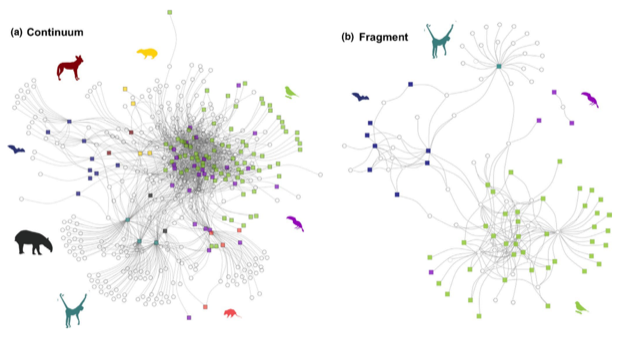

---

+ [Paper](/pdfs/Fuzessy_etal_2022_Biotropica_Functional_roles_of_frugivores_and_plants.pdf)
+ [DOI: 10.1111/btp.13065](https://doi.org/10.1111/btp.13065)

---

##### Citation

Fuzessy, L., Sobral, G., Carreira, D., Rother, D.C., Barbosa, G., Landis, M., Galetti, M., Dallas, T., Cardoso-Cláudio, V., Culot, L., Jordano, P. 2022. Functional roles of frugivores and plants shape hyper-diverse mutualistic interactions under two antagonistic conservation scenarios. Biotropica. 2022;54:444–454.

---

##### Figure

