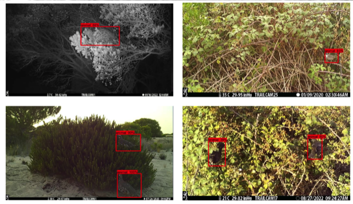

---

+ [Paper](/pdfs/Villalva_etal_2023_Protocol_recording_plant-animal_interactions_Digital_CSIC.pdf)
+ [DOI: 10.20350/digitalCSIC/15592](https://doi.org/10.20350/digitalCSIC/15592)

---

##### Citation

Villalva, P., Jordano, P. 2023. AI based workflow for recording plant animal interactions data with camera traps. Digital CSIC. doi: 10.20350/digitalCSIC/15592.

---

##### Notes

Protocol and tools for processing large numbers of video-recorded files generated during camera trap surveys for behavioral monitoring (i.e. plant-animal interactions, visits of animal frugivores to fruiting plants). A [separate GitHub repository](https://github.com/PJordano-Lab/Frugivory-camtrap-protocol) includes detailed scripts for these protocols. Version 1.1. Sep 2023.

---

##### Figure

