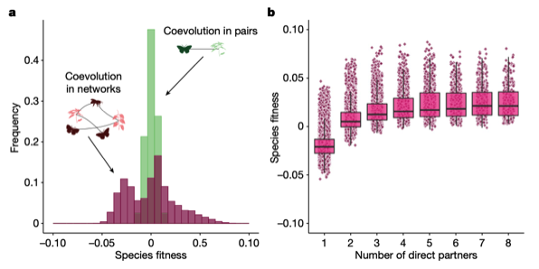

---

+ [Paper](/pdfs/Cosmo_etal_2023_Nature.pdf)
+ [DOI: 10.1038/s41586-023-06319-7](https://doi.org/10.1038/s41586-023-06319-7)

---

##### Citation

Cosmo, L.G., Assis, A.P.A., de Aguiar, M.A.M., Pires, M.M., Valido, A., Jordano, P., Thompson, J.N., Bascompte, J., Guimarães Jr., P.R. 2023. Indirect effects shape species fitness in coevolved mutualistic networks. Nature 619: 788-795.

---

##### Figure

