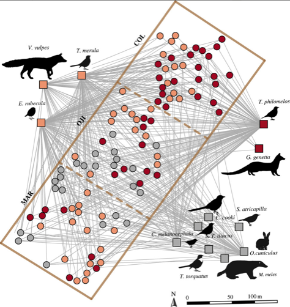

---

+ [Paper](/pdfs/Isla_etal_2023_PRSB_The_turnover_of_interactions.pdf)

---

##### Citation

Isla, J., Jácome, M., Arroyo, J.M., Jordano, P. 2023. The turnover of plant–frugivore interactions along plant range expansion: consequences for natural colonization processes. Proceedings of the Royal Society B 290 (1999), 20222547.

---

##### Figure

