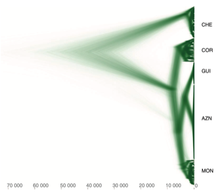

---

+ [Paper](/pdfs/Escudero_etal_2023_Annals_of_Botany_Carex_helodes.pdf)

---

##### Citation

Escudero, M., Arroyo, J. M., Sánchez-Ramírez, S. and Jordano, P. 2024. Founder events and subsequent genetic bottlenecks underlie karyotype evolution in the Ibero-North African endemic *Carex helodes*. - Annals of Botany 133: 871–882.

---

##### Figure

