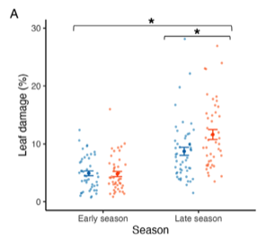

---

+ [Paper](/pdfs/Valdes‐Correcher_2025_Plant_Biology_Season_over_plant_sex_drivers_of_leaf.pdf)

---

##### Citation

Valdés‐Correcher, E., Calvo, G., Rigueiro, C., Lago‐Núñez, B., Jordano, P. and Moreira, X. 2025. Season over plant sex: drivers of leaf damage and plant defence in a dioecious Mediterranean shrub. - Plant Biol J: plb.70115.

---

##### Figure

