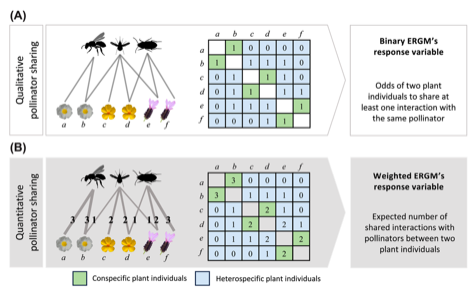

---

+ [Paper](/pdfs/Arroyo‐Correa_etal_2024_Oikos_Flowering_synchrony_modulates_pollinator_sharing_and_places_plant_individuals.pdf)

---

##### Citation

Arroyo-Correa, B., Bartomeus, I. and Jordano, P. 2024. Flowering synchrony modulates pollinator sharing and places plant individuals along a competition–facilitation continuum. - Oikos 2024: e10477.

---

##### Figure

