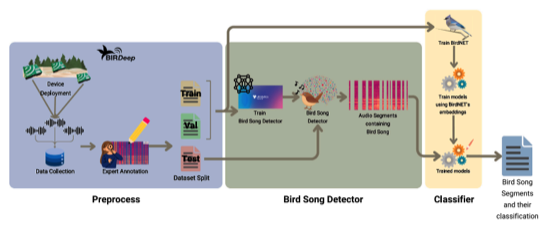

---

+ [Paper](/pdfs/Marquez_etal_2025_Ecological_Informatics_Bird_song_detector.pdf)

---

##### Citation

Márquez-Rodríguez, A., Mohedano-Munoz, M. Á., Marín-Jiménez, M. J., Santamaría-García, E., Bastianelli, G., Jordano, P. and Mendoza, I. 2025. A bird song detector for improving bird identification through deep learning: A case study from Doñana. - Ecological Informatics 90: 103254.

---

##### Figure

