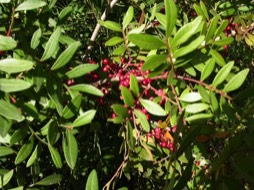

---

##### Citation

Jordano, P. 1988. Polinización y variabilidad de la producción de semillas en *Pistacia lentiscus* L. (Anacardiaceae). Anales del Jardín Botánico de Madrid 45: 213-231.

---

##### Figure

