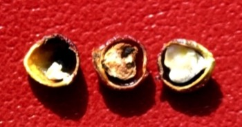

---

+ [Paper](/pdfs/Jordano_1989_Oikos_Pistacia.pdf)

---

##### Citation

Jordano, P. 1989. Pre-dispersal biology of *Pistacia lentiscus* (Anacardiaceae): cumulative effects on seed removal by birds. Oikos 55: 375-386.

---

##### Figure

