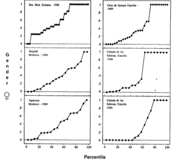

---

+ [Paper](/pdfs/Jordano1991HQBotGaz.pdf)

---

##### Citation

Jordano, P. 1991. Gender variation and expression of monoecy in *Juniperus phoenicea* (L.)(Cupressaceae). Botanical Gazette 152: 476-485.

---

##### Notes

27. Jordano, P. 1990. Utilización de los frutos de *Pistacia lentiscus* (Anacardiaceae) por el Verderón común (*Carduelis chloris*). In: Arias, L. Recuerda, P. Redondo, T. (eds.). Principios en etología. Actas I Cong. Nac. Etología. Publicaciones del Monte de Piedad y Caja Ahorros de Córdoba. Pages 145-153.

26. Jordano, P. 1990. Biología de la reproducción de tres especies del género *Lonicera* (Caprifoliaceae) en la Sierra de Cazorla. Anales del Jardín Botánico de Madrid 48: 31-52.

**1981-1989**

---

##### Figure

