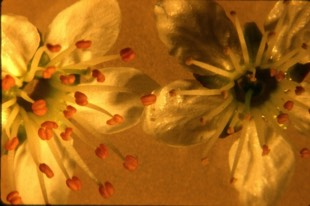

---

+ [Paper](/pdfs/Jordano1993BJLS.pdf)

---

##### Citation

Jordano, P. 1993. Pollination biology of *Prunus mahaleb* L.: deferred consequences of gender variation for fecundity and seed size. Biological Journal of the Linnean Society 50: 65-84.

---

##### Figure

