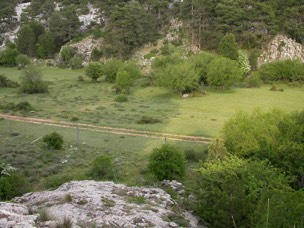

---

+ [Paper](/pdfs/Jordano_1994_Oikos_Variation_in_Prunus_dispersal.pdf)

---

##### Citation

Jordano, P. 1994. Spatial and temporal variation in the avian-frugivore assemblage of *Prunus mahaleb*: patterns and consequences. Oikos 71: 479-491.

---

##### Figure

