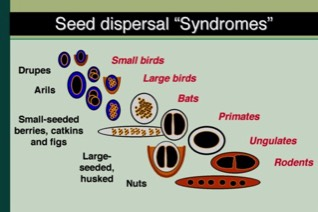

---

+ [Paper](/pdfs/Jordano95_AmNat.pdf)

---

##### Citation

Jordano, P. 1995. Angiosperm fleshy fruits and seed dispersers: a comparative analysis of adaptation and constraints in plant-animal interactions. American Naturalist 145: 163-191.

---

##### Notes

Earlier work (1984-1994)

**1990-1994**

 33. Herrera, C. M., P. Jordano, L. López Soria and J. A. Amat. 1994. Recruitment of a mast-fruiting, bird-dispersed tree: bridging frugivore activity and seedling establishment Ecological Monographs 64: 315-344.

---

##### Figure

